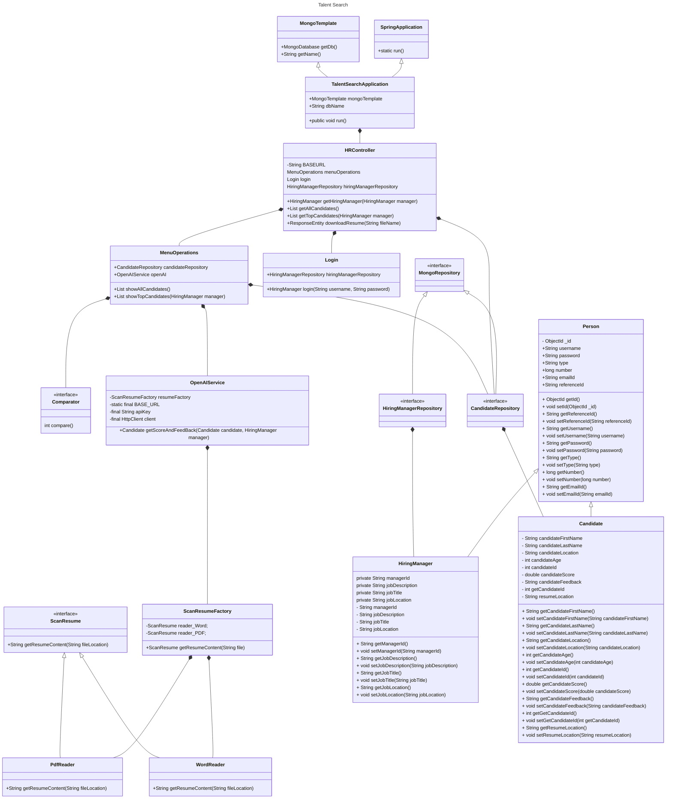

# TalentSearch

**TalentSearch** is a Java-based application powered by OpenAI, designed to assist hiring managers in identifying the most suitable candidates for job openings. The application allows hiring managers to log in, update job descriptions, and search for candidates based on specific skills and experience. By leveraging OpenAI's capabilities, **TalentSearch** analyzes job descriptions and matches them with the most qualified candidates, streamlining the recruitment process and ensuring better hiring decisions.

Instead of relying on manual searches and interviews, **TalentSearch** provides an AI-driven approach to talent acquisition, saving time and resources while improving the overall quality of hires. Unlike traditional systems that map keywords to skills, **TalentSearch** uses OpenAI's natural language processing capabilities to understand the nuances of job descriptions and identify the right candidates. This advanced approach enables hiring managers to focus on what matters most which is finding the best talent for their organization.

## Table of Content

- [Brief Intro](#talentsearch)

- [UML Diagram/Class Diagram](#system-design-for-talentSearch)

- [Getting Started](#getting-started)

- [Authors](#authors)

## System Design for TalentSearch



## Getting Started

### Backend Setup

1. Open Eclipse IDE
2. Navigate to `talent-search-backend` project
3. Locate `src/main/java/edu/neu/csye6200/application/TalentSearchApplication.java`
4. Right-click on `TalentSearchApplication.java` and select "Run as Java Application"

### Frontend Setup

Prerequisites:

- Node.js (Latest LTS version)

Steps:

1. Open Visual Studio Code
2. Navigate to `talent-search-frontend` directory
3. Open terminal and run:

```bash
npm install
npm run dev
```

The frontend server will start automatically and display the local development URL.

If the OpenAI key is not working, please generate a new from https://openrouter.ai/settings/keys and update it in the application.properties file. This may occur when the key has reached it's limit.

## Author

- [Jayanth Mani](mani.j@northeastern.edu)


