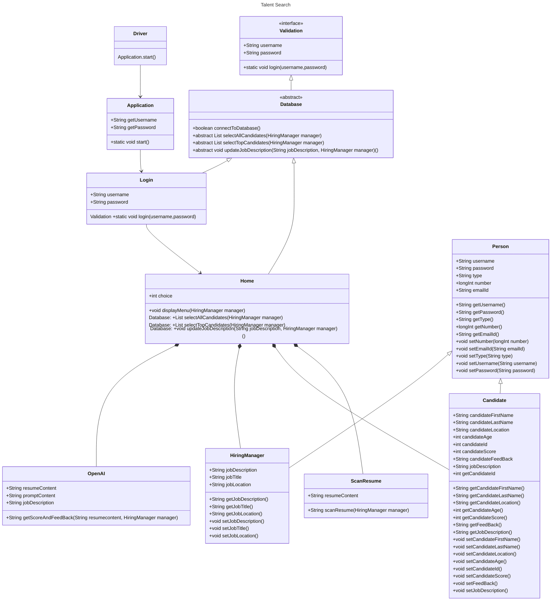

## Problem-Statement

Traditional recruitment methods often fall short in identifying the most suitable candidates for job openings. Manual processes for screening and matching candidates are time-consuming, inefficient, and prone to errors. Furthermore, traditional systems that rely on keyword matching fail to understand the nuances of job descriptions and candidate qualifications, leading to suboptimal hiring decisions.

This inefficiency poses a significant challenge for hiring managers, especially in high-volume or specialized recruitment scenarios, as they struggle to balance time constraints with the need for quality hires. There is a need for a solution that streamlines the recruitment process, enhances accuracy, and saves time and resources while ensuring better hiring outcomes.

TalentSearch addresses this problem by utilizing OpenAI's natural language processing capabilities to provide an AI-driven, scalable approach to talent acquisition.

## Table of Content

- [Problem Statement](#problem-statement)

- [Tech Stack](#tech-stack)

- [UML Diagram/Class Diagram](#class-diagram-for-talentsearch)

- [Class and Function Descriptions](#class-and-function-descriptions)

- [OOPs Concepts](#oops-concepts)

- [Milestone 2: Functionalities to be Implemented](#milestone-2-functionalities-to-be-implemented)

- [Contributions](#contributions)

- [Project Group Number/Name](#authors-of-group-1)

## Tech Stack

- **Front-End**:

  - **Java Swing** (Tentative)
  - **Alternative**: JavaFX (for modern UI/UX designs)

- **Back-End**:

  - **Java**: Core language for implementing business logic, encapsulation, and database interaction.
  - **Spring Framework**:
    - **Spring Boot**: To create and manage backend APIs for a scalable, REST-based architecture.
    - **OpenAI API Integration**: Used for natural language processing to analyze resumes and generate scores/feedback.

- **Database**:

  - **MySQL/PostgreSQL**: For structured data storage such as user credentials, job descriptions, and candidate profiles.
  - **MongoDB** (Optional): If there’s a need to store unstructured or semi-structured data (e.g., scanned resume content).

- **IDE/Tools**:
  - IntelliJ IDEA/Eclipse/VS Code - For Java development.

## Class Diagram for TalentSearch

## OOPs Concepts

The TalentSearch application implements several core **Object-Oriented Programming (OOP)** concepts, which include:

### 1. Encapsulation

- **Definition**: Encapsulation binds data and methods that manipulate the data into a single unit (class) and restricts direct access to some of the object's components.
- **Implementation**:
  - Classes like `Person`, `HiringManager`, and `Candidate` encapsulate attributes such as `username`, `password`, `jobTitle`, etc., along with getter and setter methods to control access to these properties.
  - Sensitive data like passwords are managed through encapsulation to ensure secure access.

### 2. Inheritance

- **Definition**: Inheritance allows a class to acquire the properties and behaviors of another class.
- **Implementation**:
  - The `HiringManager` and `Candidate` classes inherit from the `Person` class, reusing common attributes like `username` and `emailId`.
  - The `Login` and `Home` classes inherit functionality from the `Database` abstract class, ensuring consistent implementation across database operations.

### 3. Polymorphism

- **Definition**: Polymorphism allows methods to perform different tasks based on the object calling them.
- **Implementation**:
  - **Method Overriding**: Classes like `Login` and `Home` override methods from the abstract `Database` class, providing their specific implementations for database operations such as `connectToDatabase()` or `selectTopCandidates()`.
  - Interfaces like `Validation` allow multiple implementations of methods like `login()`.

### 4. Abstraction

- **Definition**: Abstraction focuses on exposing essential features while hiding implementation details.
- **Implementation**:
  - The `Database` class is abstract and provides a template for methods such as `selectAllCandidates()` and `updateJobDescription()` that must be implemented by derived classes.
  - The interface `Validation` abstracts the concept of user authentication, leaving the implementation to the `Login` class.

### 5. Composition

- **Definition**: Composition involves using objects of one class within another class to achieve functionality.
- **Implementation**:
  - The `Home` class uses objects of `HiringManager`, `Candidate`, and `OpenAI` to perform specific tasks like scanning resumes, fetching top candidates, or updating job descriptions.

### 6. Classes and Objects

- **Definition**: Classes act as blueprints for creating objects, which are instances of the class.
- **Implementation**:
  - Classes such as `HiringManager`, `Candidate`, `OpenAI`, and `ScanResume` represent distinct real-world entities, with their objects being used to interact dynamically within the application.

### 7. Association

- **Definition**: Association establishes a relationship between classes.
- **Implementation**:
  - The `HiringManager` class is associated with the `Home` class to facilitate job description updates.
  - The `Candidate` class interacts with the `OpenAI` class to score and rank resumes.

---

These concepts collectively enable the modular, reusable, and maintainable design of the **TalentSearch** application, ensuring robust and scalable functionality.

---

## Class and Function Descriptions

### **Person.java**

The `Person.java` is the baseclass that will be extended by the `HiringManager.java` and the `Candidate.java` class.

### **HiringManager.java**

The `HiringManager.java` class will be used to create the object for the Hiring Manager. It extends the `Person.java` class.

### **Candidate.java**

The `Candidate.java` class will be used to create the object for the Candidate. It extends the `Person.java` class.

### **Driver.java**

This is the starting point of the application which will call the static `start()` from the **Application.java** class.

### **Application.java**

The Hiring Manager's credential will be accquired. The `getUserName` and `getPassword` varaiables are used to get username and password from the user.

#### **public void start()** method from Application.java

The `start()` method will call the **Login.java**'s static static `login()` method by passing `getUserName` and `getPassword`.

### **Validation.java**

The `Validation.java` interface will have `username` and `password` String variables and a static `login()` which has to be implemented by the `Login.java` class implementing this interface.

### **Database.java**

This abstract class is used to contain the methods that are used to perform operations in the database. This abstract class implements the **Validation.java** interface.

#### **public boolean connectToDatabase()** method from Database.java

The `connecToDatabase()` will be used to connect from the **Login.java** class as well as from the **Home.java** class to the database.

### **Login.java**

The `Login.java` has been inherited from the abstract class **Database.java** which further implements the **Validation.java** interface. The `Login.java` implements the `login()` from the **Validation.java** interface and the `connectToDatabase()` from the **Database.java** abstract class.

#### **public static void login(username,password)** method from Login.java

The `public static void login(username,password)` method will use the `connectToDataBase()` from the **Database.java** abstract class to connect to the database. If the connection is successfull, it will authenticate the user with the given username and password. If the authentication is successfull, it will call the **Home.java**'s `displayMenu()` method. If the authentication fails, it will print the error message and get back to `Application.java`'s `start()` to ask for the username and password again.

### **Home.java**

The `Home.java` class will have the `displayMenu()` method which will display the menu to the user. The user will be able to choose from the following options: - Select top candidates for the relevant job - Selct all the candidates for the relevant job - Update the job description

#### **public void displayMenu(HiringManager manager)** method from Home.java

The `displayMenu()` method will display the menu to the user. Based on the choice entered by the user, the corresponding method will be called. The Hiring Manager object accquired as to update the job description for the relevant hiringManager. If the user chooses update job description, the user will be asked to enter the new job description. The new job description will be updated in the database.

#### **public List<Candidate> selectAllCandidates(HiringManager manager)** method from Home.java

The `selectAllCandidates()` extended from the abstract `Database.java` class will be used to select all the candidates for the relevant job. The candidates will be selected from the database by mapping the candidate's applied job description with the hiring manager's job description.

#### **public List<Candidate> selectTopCandidates(HiringManager manager)** method from Home.java

The `selectTopCandidates()` extended from the abstract `Database.java` class will be used to select the top candidates for the relevant job. The candidates will be selected from the database by mapping the candidate's applied job description with the hiring manager's job description. All the candidate's resume will be scanned using the `ScanResume`'s `scanResume()` which will return the content of the resume in a String format which will be sent to the `OpenAI.java` class to get the candidate's score. The candidate's score and feedback will be sent as a String back which be will be saved along with the candidate's object in the database. Candidates who are having a score will not be sent to OpenAI so that we can save the time for calling OpenAI API. Finally, The candidates will be sorted based on their score in descending order.

#### **public void updateJobDescription(HiringManager manager, String jobDescription)** method from Home.java

The `updateJobDescription()` will accquire the manager object as well as jobDescription and will update the job description in the database. This method has been extended from the abstract `Database.java` class.

### **OpenAI.java**

The `OpenAI.java` class will have the function to calculate the candidate's score and feedback. The candidate's resume content will be sent to the OpenAI API to get the candidate's score and feedback.

#### **public String getScoreAndFeedback(String resume, HiringManager manager)** method from OpenAI.java

The string resume along with the job description and customised prompt will be sent to the OpenAI API to get the candidate's score and feedback. The score and will be returned as a string which will be saved along with the candidate's object in the database.

### **ScanResume.java**

The `ScanResume.java` is used read and process of candidate's resume.

#### **public String scanResume(String resume)** method from ScanResume.java

The candidate's resume will be scanned and the content will be returned as a string.

## Milestone 2: Functionalities to be Implemented

By the end of Milestone 2, the following goals will be achieved:

1. **Login and Authentication**:

   - Implement `Validation` interface and `Login` class to authenticate hiring managers with username and password.

2. **Database Integration**:

   - Establish database connectivity via the `Database` abstract class.
   - Implement methods to fetch all candidates, fetch top candidates, and update job descriptions.

3. **Candidate Management**:

   - Develop `Candidate` class to manage candidate profiles including attributes like score, feedback, and job description.

4. **Job Description Management**:

   - Enable `HiringManager` class to update and retrieve job descriptions.

5. **Resume Scanning and Scoring**:

   - Integrate the `ScanResume` class to process resumes.
   - Utilize `OpenAI` API for candidate scoring and feedback generation.

6. **Menu Navigation**:

   - Implement the `Home` class to provide a user-friendly menu for hiring managers to select operations.

7. **Driver Program**:
   - Develop the `Driver` class to serve as the entry point for initializing and running the application.

These goals align with the functionalities outlined in the UML diagram, ensuring a fully functional Java application by the milestone's completion.

## Contributions

Although everyone contributed collaboratively throughout the project, the following highlights some of the key roles and individual contributions:

### Jayanth Mani

- Coordinated overall topic selection and ensured alignment among team members.
- Managed all documentation tasks, including preparing the README and related project workflows like diagrams and methods.
- Set up the GitHub repository and implemented proper version control practices.

### Adharsh Rengarajan

- Designed and developed the UML diagram for the TalentSearch application.
- Provided valuable input on aligning the UML structure with implementation requirements.
- Contributed to integrating OpenAI features into the application.

### Xinduo Fan

- Created the flow diagram to illustrate the application's workflow.
- Assisted in planning the application's functionality and integration.
- Supported the team in understanding and applying various technologies.

### Zuoyu Wang

- Organized the workflow and delegated tasks among team members.
- Implemented the `Person`, `HiringManager`, and `Candidate` classes.
- Contributed insights for gaming technology integration to enhance the project.

### Sai Kalyan Burra

- Focused on developing the `Application`, `Login`, `Database`, and `Validation` classes.
- Played a critical role in ensuring seamless integration of backend logic.
- Brought innovative ideas to the project's functionality.

## Authors of Group 1

- [Jayanth Mani](mani.j@northeastern.edu)
- [Sai Kalyan Burra](burra.sa@northeastern.edu)
- [Xinduo Fan](fan.xind@northeastern.edu)
- [Zuoyu Wang](wang.zuoy@northeastern.edu)
- [Adharsh Rengarajan](rengarajan.ad@northeastern.edu)
